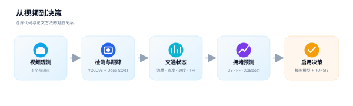
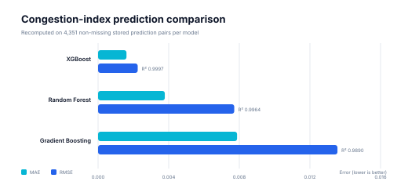
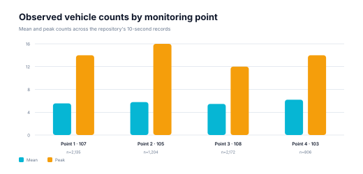

<p align="center">
  
</p>

# 基于视频监控的高速公路拥堵预测与应急车道决策

面向高速公路管理场景的数学建模竞赛项目：从多点视频中检测和跟踪车辆，构建流量、密度、速度与交通性能指数（TPI），再用机器学习预测拥堵，并用概率模型与 TOPSIS 支持应急车道启用决策。

> **项目状态：竞赛归档 · 公开整理版。** 本项目获得 2024 年第二十一届“华为杯”中国研究生数学建模竞赛二等奖。仓库保留竞赛期实现和派生数据，用于学习、复核与二次研究；它不是可直接部署的交通控制系统。

## 项目亮点

- **端到端思路**：视频观测、车辆跟踪、交通状态估计、拥堵预测和决策评价形成完整链路。
- **多模型对比**：仓库保留 Gradient Boosting、Random Forest 与 XGBoost 的逐帧预测结果。
- **多目标决策**：论文方法使用熵权法与改进 TOPSIS 量化应急车道启用效果。
- **可审计整理**：原始数据、派生结果、实验性扰动和第三方实现被明确分区；README 图表可由脚本重建。
- **隐私优先**：获奖证书、投稿源文件和真实数据库配置不作为公开仓库内容。

## 方法总览

<p align="center">
  
</p>

| 阶段 | 输入 | 方法 | 主要输出 |
|---|---|---|---|
| 车辆感知 | 四个监测点的视频 | YOLOv5 + Deep SORT（本仓库实现） | 车辆轨迹与区间计数 |
| 状态估计 | 车辆计数和时间戳 | 流量、密度、速度、平滑与 TPI | 交通状态序列 |
| 拥堵预测 | 历史状态序列 | Gradient Boosting、Random Forest、XGBoost | 拥堵/阻塞系数预测 |
| 启用决策 | 状态与容量约束 | 中断概率模型、熵权法、改进 TOPSIS | 应急车道启用评分 |
| 布点优化 | 多点时序信息 | 论文中的 LSTM 方案 | 监控点布局建议 |

更完整的建模说明、假设和“论文方法—仓库代码”边界见 [建模方法说明](docs/methodology.md)。

## 结果速览

下表由 `scripts/evaluate_predictions.py` 从仓库中的三个预测工作簿重新计算。每个文件有 21,781 行，其中 4,351 行同时含有实际值与预测值；指标只评价这部分非空记录。

| 模型 | MAE | RMSE | R² | 有效评价行 |
|---|---:|---:|---:|---:|
| XGBoost | 0.001648 | 0.002300 | 0.999698 | 4,351 |
| Random Forest | 0.003872 | 0.007902 | 0.996435 | 4,351 |
| Gradient Boosting | 0.008066 | 0.013893 | 0.988980 | 4,351 |

<p align="center">
  
</p>

这些指标来自已保存的预测结果，不等同于重新训练后的独立泛化评估。训练/验证划分和随机种子未在原始代码中完整保留，因此不应把该表当作生产性能承诺。

<p align="center">
  
</p>

## 快速开始

### 1. 只复核数据与图表

建议使用 Python 3.10 或更新版本，并在独立虚拟环境中安装分析依赖：

```bash
python -m venv .venv
source .venv/bin/activate
pip install -r requirements-analysis.txt

python scripts/evaluate_predictions.py
python scripts/generate_readme_assets.py
```

指标会写入 `results/model-comparison.csv`，两张 SVG 图会更新到 `docs/readme-assets/`。

### 2. 运行车辆跟踪原型

跟踪代码来自竞赛期环境，原始依赖以 Python 3.7.12、PyTorch 1.8 为基线。建议在隔离环境中安装：

```bash
pip install -r Vehicle-tracking-main/requirements.txt

cd Vehicle-tracking-main/application/main
python app_track.py \
  --config ../../settings/config.yml \
  --source /path/to/input-video.mp4 \
  --device cpu
```

默认权重位于 `Vehicle-tracking-main/models/`。如启用数据库上传，请复制
`Vehicle-tracking-main/settings/db_config.example.yml` 为本地
`db_config.yml`，或设置 `TRAFFIC_DATABASE_URL`；不要提交真实连接信息。

### 3. 复用数据处理工具

```bash
# 给跟踪器文本结果补充固定间隔时间戳
python scripts/add_timestamps.py raw.txt timestamped.txt \
  --start 2024-05-01T11:41:03 --step-seconds 10

# 提取整洁的车辆计数 CSV
python scripts/extract_vehicle_counts.py timestamped.txt counts.csv

# 从区间计数推导流量、密度与速度
python scripts/calculate_traffic_metrics.py counts.csv metrics.csv \
  --interval-seconds 10 --road-length-meters 20
```

## 仓库结构

```text
.
├── Vehicle-tracking-main/      # 竞赛期 YOLOv5 + Deep SORT 跟踪原型
├── data/
│   ├── vehicle-counts/         # 四个监测点的区间车辆计数
│   ├── model-outputs/          # TPI、TOPSIS 与预测结果
│   └── experimental-perturbation/
├── docs/
│   ├── methodology.md          # 建模方法、证据边界与限制
│   └── readme-assets/          # 项目本地 SVG 配图
├── results/                    # 由脚本重算的汇总指标
├── scripts/                    # 参数化数据处理与可视化工具
└── requirements-analysis.txt   # 轻量分析依赖
```

数据来源、字段与再分发边界见 [data/README.md](data/README.md)。第三方代码与模型说明见 [THIRD_PARTY_NOTICES.md](THIRD_PARTY_NOTICES.md)。

## 已知限制

- 论文方法描述 YOLOv8，仓库中可运行的跟踪实现则是 YOLOv5 + Deep SORT；二者不能视为同一个实验版本。
- 原始交通视频未纳入公开整理版，无法从视频端完整重放所有结果。
- LSTM 布点优化和完整训练流水线未在当前代码树中保留。
- 预测工作簿前 17,430 行没有预测值，当前指标只基于剩余 4,351 个配对样本。
- 数据库、FastAPI 和旧版深度学习依赖属于竞赛原型，部署前需要单独做安全、兼容性与负载验证。
- 应急车道启用涉及道路安全与法规，本项目只能作为研究参考，不能替代交通主管部门的专业判断。

## 贡献

欢迎提交可复现性修复、数据字典补充、测试与文档改进。提交前请阅读 [CONTRIBUTING.md](CONTRIBUTING.md)，安全问题请按 [SECURITY.md](SECURITY.md) 处理。

## 许可状态

顶层开源许可证仍待参赛团队确认。仓库内嵌的 YOLOv5 代码使用 GPL-3.0，Deep SORT 代码使用 MIT；在顶层许可证确定前，请不要推定本项目其余代码或数据已获得再使用授权。
